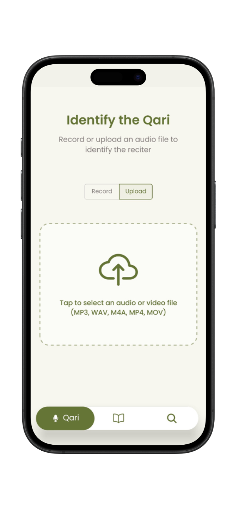
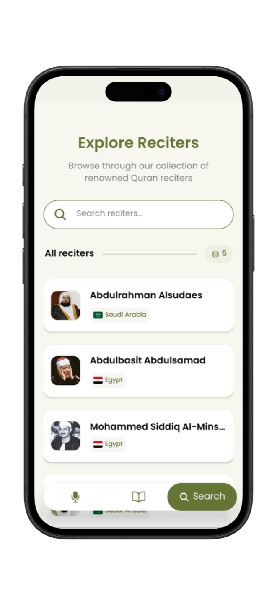
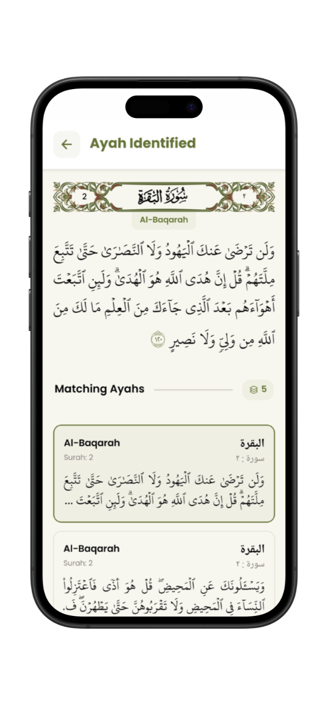

# Qurrā - Quran Reciter Classifier Mobile App

A React Native mobile application that provides an intuitive interface for identifying Quran reciters and verses from audio recordings. Qurrā connects to the [Quran Reciter Classifier backend](https://github.com/xyzeez/quran-reciter-classifier) to deliver real-time AI-powered predictions with a beautiful, Islamic-themed user interface.

## Screenshots

<div align="center">
  
  
  
  
</div>

<div align="center">
  
   
  
  
</div>

## Features

- **Reciter Identification**: Identify Quran reciters from audio recordings with confidence scores
- **Ayah Recognition**: Recognize specific verses (Ayahs) from Quran recitations
- **Audio Recording**: Built-in recording functionality with customizable duration limits
- **File Upload**: Support for multiple audio formats (MP3, WAV, M4A, MP4, MOV)
- **Audio Playback**: Play reference recordings from identified reciters
- **Search Functionality**: Browse and search through a comprehensive database of reciters
- **Beautiful UI**: Modern, Islamic-themed interface with Arabic font support

## Technical Stack

### Frontend

- **React Native** (0.76.8) - Cross-platform mobile development
- **Expo** (~52.0.42) - Development platform and build tools
- **TypeScript** (^5.3.3) - Type-safe JavaScript
- **Expo Router** (~4.0.19) - File-based navigation
- **React Native Reanimated** (~3.16.1) - Advanced animations

### Audio Processing

- **Expo AV** (~15.0.2) - Audio recording and playback
- **Expo Document Picker** (~13.0.3) - File selection

### UI Components

- **@expo/vector-icons** (^14.0.2) - Icon library
- **@gorhom/bottom-sheet** (^5.1.2) - Bottom sheet modals
- **React Native SVG** (^15.11.2) - Vector graphics
- **React Native Gesture Handler** (~2.20.2) - Touch gestures

### Typography

- **@expo-google-fonts/poppins** - Modern sans-serif font
- **@expo-google-fonts/amiri** - Arabic font support
- **Custom Arabic fonts**: Uthmanic Hafs, QPC Hafs, Surah Names

## Project Structure

```
quran-reciter-classifier-app/
├── app/                          # Main application screens
│   ├── (tabs)/                   # Tab-based navigation
│   │   ├── index.tsx            # Reciter identification screen
│   │   ├── ayah.tsx             # Ayah identification screen
│   │   ├── search.tsx           # Reciter search screen
│   │   └── _layout.tsx          # Tab layout configuration
│   ├── (modals)/                # Modal screens
│   │   ├── ReciterPrediction.tsx # Reciter prediction results
│   │   ├── AyahPrediction.tsx   # Ayah prediction results
│   │   └── _layout.tsx          # Modal layout configuration
│   └── _layout.tsx              # Root layout with fonts
├── components/                   # Reusable UI components
├── constants/                    # App constants
│   └── Colors.ts                # Color palette
├── services/                     # API services
│   ├── reciterService.ts        # Reciter prediction API
│   └── ayahService.ts           # Ayah prediction API
├── types/                        # TypeScript type definitions
├── assets/                       # Static assets
│   ├── fonts/                   # Custom Arabic fonts
│   └── images/                  # App images and icons
└── configs.ts                   # Configuration constants
```

## Installation

### Prerequisites

- **Node.js** (≥ 18.0.0)
- **npm** or **yarn**
- **Expo CLI** (`npm install -g @expo/cli`)
- **iOS Simulator** (for iOS development) or **Android Studio** (for Android development)

### Setup

1. **Clone the repository**

   ```bash
   git clone <repository-url>
   cd quran-reciter-classifier-app
   ```

2. **Install dependencies**

   ```bash
   npm install
   ```

3. **Configure API endpoint**

   Update the API URL in `configs.ts`:

   ```typescript
   export const API_URL = "http://YOUR_SERVER_IP:PORT";
   ```

4. **Start the development server**

   ```bash
   npx expo start
   ```

5. **Run on device/simulator**
   - **iOS**: Press `i` in the terminal or scan QR code with Camera app
   - **Android**: Press `a` in the terminal or scan QR code with Expo Go app
   - **Web**: Press `w` in the terminal

## Configuration

### API Configuration (`configs.ts`)

```typescript
export const API_URL = "http://YOUR_SERVER_IP:PORT";
export const RECITER_MAX_RECORDING_DURATION_SECONDS = 15;
export const AYAH_MAX_RECORDING_DURATION_SECONDS = 15;
```

- `API_URL`: Backend server endpoint (replace with your server IP and port)
- `RECITER_MAX_RECORDING_DURATION_SECONDS`: Maximum recording time for reciter identification
- `AYAH_MAX_RECORDING_DURATION_SECONDS`: Maximum recording time for Ayah identification

### Backend Requirements

The app requires the [Quran Reciter Classifier backend server](https://github.com/xyzeez/quran-reciter-classifier) running on the specified API_URL with the following endpoints:

- `POST /getReciter` - Reciter identification from audio
- `POST /getAyah` - Ayah identification from audio
- `GET /getAllReciters` - Retrieve reciter database

## Development Commands

```bash
# Start development server
npx expo start

# Start with specific platform
npx expo start --ios
npx expo start --android
npx expo start --web

# Build for production
npx expo build:ios
npx expo build:android

# Clear cache
npx expo start --clear
```

## App Features

### Reciter Identification

- Record audio up to 15 seconds or upload audio files
- AI-powered reciter identification with confidence scores
- Display of top predictions with detailed information
- Audio playback of reference recordings

### Ayah Recognition

- Identify specific Quran verses from recitations
- Display matched Ayahs with Arabic text and translations
- Support for multiple similar matches
- Formatted display with proper Arabic typography

### Audio Features

- High-quality audio recording (44.1kHz, AAC encoding)
- Support for multiple audio formats
- Real-time recording duration display
- Audio playback controls with progress tracking
